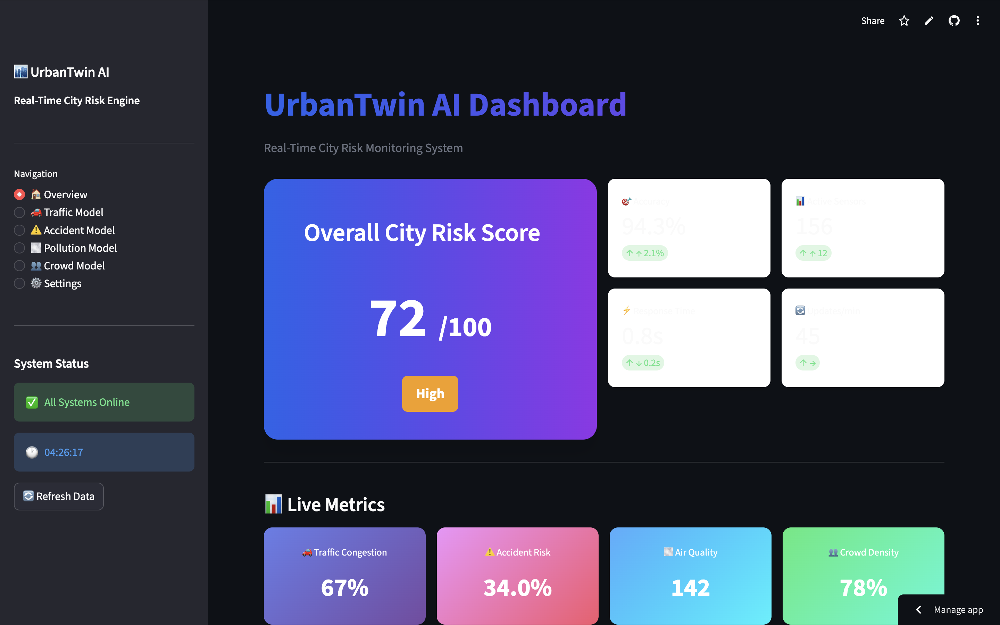

# AI-Traffic-Managment System streamlit
AI-Based Traffic Monitoring and Management System
# 🚦 AI Traffic Monitoring System

🔗 **Live App:**  
👉 https://ai-traffic-app-3qspdhps2uihbqxnlvj4se.streamlit.app/

---

## 📌 Overview
This project is an AI-based traffic monitoring system that analyzes real-time traffic data to detect congestion patterns and improve traffic management.

---

## ⚙️ Tech Stack
- Python
- OpenCV
- Streamlit
- Pandas

---

## 📊 Features
- Real-time traffic data analysis
- Congestion detection using computer vision
- Interactive dashboard using Streamlit
- Visualization of traffic patterns and trends
- 

---
